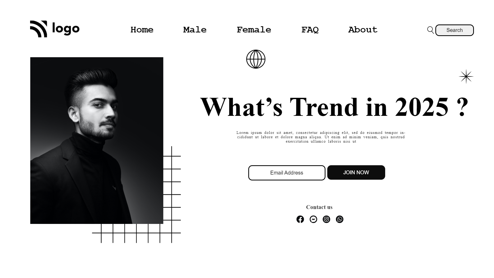

# street style landing page
- so we can use display:grid ,so that all in ul will align in inline
- by using position:absolute and relative we create web page 
- we need some width and height for changes in img height
- 
- finally done within 2hrs